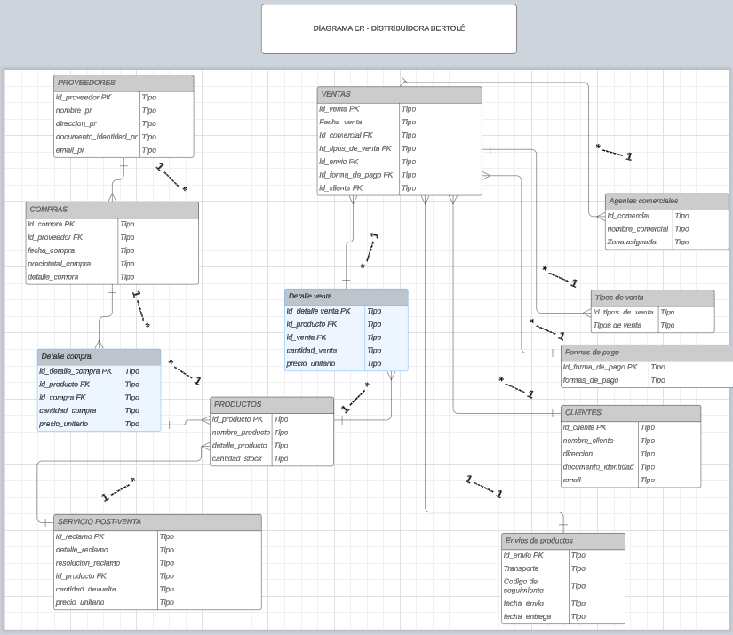
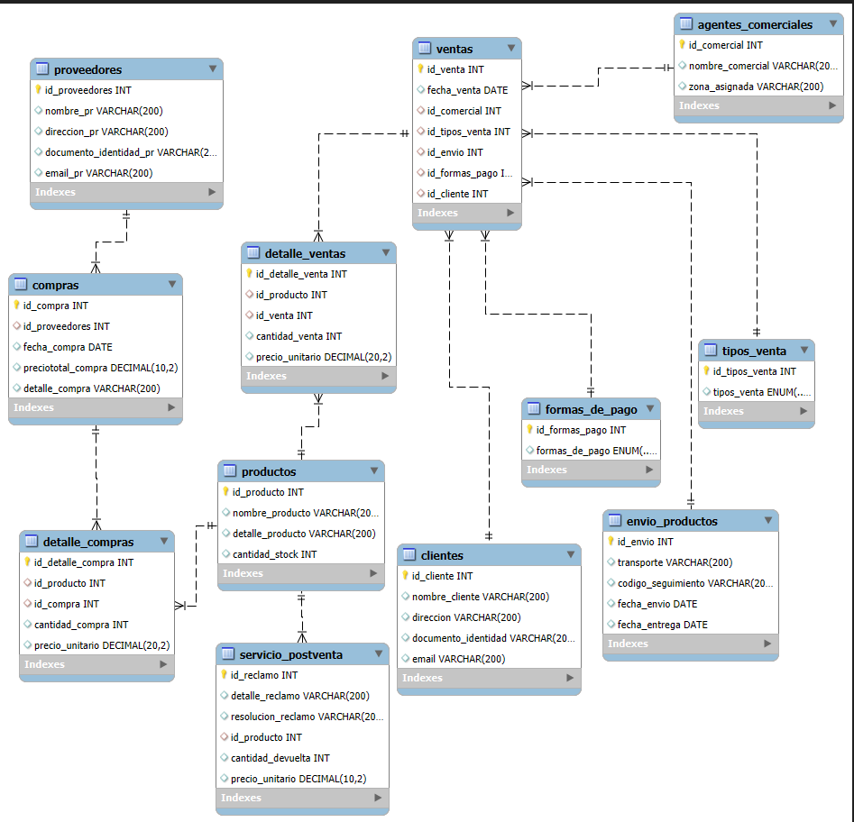

## DER ONTOLOGICO DE DISTRIBUIDORA

## DER WORKBENCH

# SQLCODER
# Base de Datos: DISTRIBUIDORA

Este proyecto define la estructura de una base de datos para una distribuidora, permitiendo gestionar proveedores, productos, ventas, compras, clientes, envíos y servicios postventa.

## Tablas Sin Claves Foráneas (FK)

### `proveedores`
- **Descripción**: Almacena la información de los proveedores.
- **Columnas**:
  - `id_proveedores` (INT, NOT NULL, AUTO_INCREMENT, PRIMARY KEY)
  - `nombre_pr` (VARCHAR(200))
  - `direccion_pr` (VARCHAR(200))
  - `documento_identidad_pr` (VARCHAR(20))
  - `email_pr` (VARCHAR(200), UNIQUE)

### `formas_de_pago`
- **Descripción**: Define las diferentes formas de pago disponibles.
- **Columnas**:
  - `id_formas_pago` (INT, NOT NULL, AUTO_INCREMENT, PRIMARY KEY)
  - `formas_de_pago` (ENUM('CONTADO', 'CUENTA CORRIENTE', 'FINANCIADO'))

### `tipos_venta`
- **Descripción**: Define los tipos de venta.
- **Columnas**:
  - `id_tipos_venta` (INT, NOT NULL, AUTO_INCREMENT, PRIMARY KEY)
  - `tipos_venta` (ENUM('PRESENCIAL', 'CONTACTOS COMERCIALES'))

### `agentes_comerciales`
- **Descripción**: Almacena la información de los agentes comerciales.
- **Columnas**:
  - `id_comercial` (INT, NOT NULL, AUTO_INCREMENT, PRIMARY KEY)
  - `nombre_comercial` (VARCHAR(200))
  - `zona_asignada` (VARCHAR(200))

### `productos`
- **Descripción**: Almacena la información de los productos.
- **Columnas**:
  - `id_producto` (INT, NOT NULL, AUTO_INCREMENT, PRIMARY KEY)
  - `nombre_producto` (VARCHAR(200))
  - `detalle_producto` (VARCHAR(200))
  - `cantidad_stock` (INT)

### `clientes`
- **Descripción**: Almacena la información de los clientes.
- **Columnas**:
  - `id_cliente` (INT, NOT NULL, AUTO_INCREMENT, PRIMARY KEY)
  - `nombre_cliente` (VARCHAR(200))
  - `direccion` (VARCHAR(200))
  - `documento_identidad` (VARCHAR(200))
  - `email` (VARCHAR(200), UNIQUE)

### `envio_productos`
- **Descripción**: Almacena la información de los envíos de productos.
- **Columnas**:
  - `id_envio` (INT, NOT NULL, AUTO_INCREMENT, PRIMARY KEY)
  - `transporte` (VARCHAR(200))
  - `codigo_seguimiento` (VARCHAR(200))
  - `fecha_envio` (DATE)
  - `fecha_entrega` (DATE)

## Tablas Con Claves Foráneas (FK)

### `compras`
- **Descripción**: Almacena las compras realizadas a los proveedores.
- **Columnas**:
  - `id_compra` (INT, NOT NULL, AUTO_INCREMENT, PRIMARY KEY)
  - `id_proveedores` (INT, FOREIGN KEY)
  - `fecha_compra` (DATE)
  - `preciototal_compra` (DECIMAL(10,2))
  - `detalle_compra` (VARCHAR(200))

### `ventas`
- **Descripción**: Almacena las ventas realizadas a los clientes.
- **Columnas**:
  - `id_venta` (INT, NOT NULL, AUTO_INCREMENT, PRIMARY KEY)
  - `fecha_venta` (DATE)
  - `id_comercial` (INT, FOREIGN KEY)
  - `id_tipos_venta` (INT, FOREIGN KEY)
  - `id_envio` (INT, FOREIGN KEY)
  - `id_formas_pago` (INT, FOREIGN KEY)
  - `id_cliente` (INT, FOREIGN KEY)

### `detalle_ventas`
- **Descripción**: Almacena los detalles de cada venta realizada.
- **Columnas**:
  - `id_detalle_venta` (INT, NOT NULL, AUTO_INCREMENT, PRIMARY KEY)
  - `id_producto` (INT, FOREIGN KEY)
  - `id_venta` (INT, FOREIGN KEY)
  - `cantidad_venta` (INT)
  - `precio_unitario` (DECIMAL(20, 2))

### `detalle_compras`
- **Descripción**: Almacena los detalles de cada compra realizada.
- **Columnas**:
  - `id_detalle_compra` (INT, NOT NULL, AUTO_INCREMENT, PRIMARY KEY)
  - `id_producto` (INT, FOREIGN KEY)
  - `id_compra` (INT, FOREIGN KEY)
  - `cantidad_compra` (INT)
  - `precio_unitario` (DECIMAL(20, 2))

### `servicio_postventa`
- **Descripción**: Almacena los reclamos y servicios postventa.
- **Columnas**:
  - `id_reclamo` (INT, NOT NULL, AUTO_INCREMENT, PRIMARY KEY)
  - `detalle_reclamo` (VARCHAR(200))
  - `resolucion_reclamo` (VARCHAR(200))
  - `id_producto` (INT, FOREIGN KEY)
  - `cantidad_devuelta` (INT)
  - `precio_unitario` (DECIMAL(10, 2))

## Relaciones

### Relación: `ventas` - `agentes_comerciales`
- **Tipo**: 1 a N
- **Descripción**: Un agente comercial puede estar asociado a múltiples ventas, pero cada venta solo tiene un agente comercial.

### Relación: `ventas` - `tipos_venta`
- **Tipo**: 1 a N
- **Descripción**: Un tipo de venta puede estar asociado a múltiples ventas, pero cada venta solo tiene un tipo de venta.

### Relación: `ventas` - `envio_productos`
- **Tipo**: 1 a N
- **Descripción**: Un envío de productos puede estar asociado a múltiples ventas, pero cada venta solo tiene un envío de productos.

### Relación: `ventas` - `formas_de_pago`
- **Tipo**: 1 a N
- **Descripción**: Una forma de pago puede estar asociada a múltiples ventas, pero cada venta solo tiene una forma de pago.

### Relación: `ventas` - `clientes`
- **Tipo**: 1 a N
- **Descripción**: Un cliente puede estar asociado a múltiples ventas, pero cada venta solo tiene un cliente.

### Relación: `compras` - `proveedores`
- **Tipo**: 1 a N
- **Descripción**: Un proveedor puede estar asociado a múltiples compras, pero cada compra solo tiene un proveedor.

### Relación: `detalle_ventas` - `productos`
- **Tipo**: 1 a N
- **Descripción**: Un producto puede estar asociado a múltiples detalles de ventas, pero cada detalle de venta solo tiene un producto.

### Relación: `detalle_ventas` - `ventas`
- **Tipo**: 1 a N
- **Descripción**: Una venta puede estar asociada a múltiples detalles de ventas, pero cada detalle de venta solo tiene una venta.

### Relación: `detalle_compras` - `productos`
- **Tipo**: 1 a N
- **Descripción**: Un producto puede estar asociado a múltiples detalles de compras, pero cada detalle de compra solo tiene un producto.

### Relación: `detalle_compras` - `compras`
- **Tipo**: 1 a N
- **Descripción**: Una compra puede estar asociada a múltiples detalles de compras, pero cada detalle de compra solo tiene una compra.

### Relación: `servicio_postventa` - `productos`
- **Tipo**: 1 a N
- **Descripción**: Un producto puede estar asociado a múltiples servicios postventa, pero cada servicio postventa solo tiene un producto.

## Problemáticas Resueltas

- **Gestión de Proveedores**: Permite almacenar y gestionar información detallada de los proveedores.
- **Control de Formas de Pago**: Facilita el control de las diferentes formas de pago utilizadas en las ventas.
- **Gestión de Ventas y Compras**: Permite registrar y gestionar ventas y compras de manera detallada, incluyendo detalles específicos de cada transacción.
- **Seguimiento de Envíos**: Proporciona un sistema para seguir y gestionar los envíos de productos.
- **Atención al Cliente y Postventa**: Facilita la gestión de reclamos y servicios postventa, mejorando la atención al cliente y la satisfacción postventa.
- **Análisis de Datos**: La estructura relacional permite realizar análisis detallados de las ventas, compras, inventarios y servicios postventa, proporcionando información valiosa para la toma de decisiones estratégicas.
